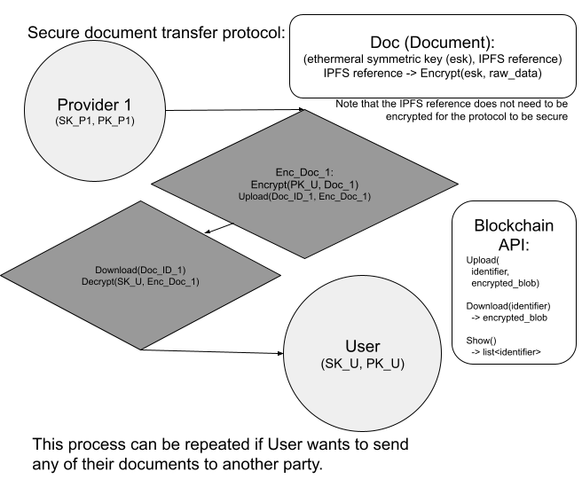
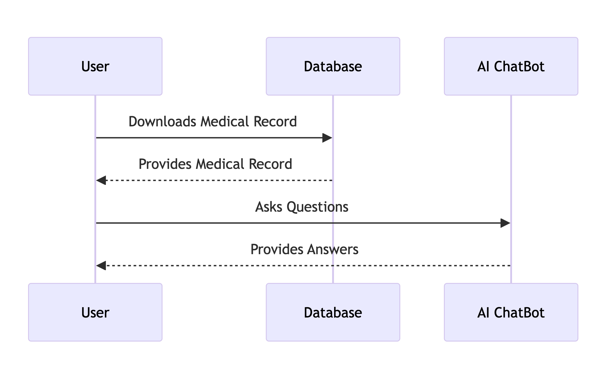
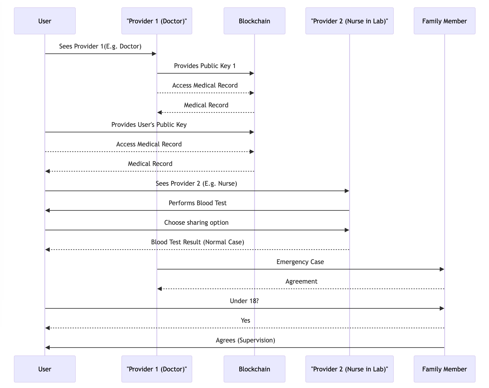

# Welcome to Family+

**Family+** is an innovative web application that leverages the power of AI and blockchain technology to revolutionize the way individuals understand and utilize their medical documents. This platform brings together cutting-edge features such as AI-enhanced document comprehension, a secure blockchain network, and a unique role-based system with Doctors, Patients, and Family Members. It's a groundbreaking project that merges AI and blockchain to empower individuals with a deeper understanding of their medical documents. By providing users with greater control over their health information, we aim to improve healthcare outcomes and potentially reduce costs. With **Family+**, you'll gain better control over your health information and make more informed healthcare decisions.

## Table of Contents
  - [Key Features](#key-features)
  - [AI Models](#ai-models)
  - [Blockchain Architecture](#blockchain-architecture)
  - [Diagrams](#diagrams)
  - [Disclaimer](#disclaimer)
  - [License](#license)
  - [Reference](#reference)

### Key Features

- **AI-Enhanced Document Comprehension**: Our AI system interprets complex medical documents, simplifying terminology and presenting information in a user-friendly manner.

- **Secure Blockchain Network**: Family+ employs blockchain technology to ensure the security and immutability of your health data.

- **Supervisors and Users**: This unique role-based system allows medical professionals (Supervisors) to guide and clarify medical information for users, creating a collaborative healthcare experience.

- **Improved Healthcare Decision-Making**: By better understanding their medical documents, users can make more informed decisions about their health and treatment options.

- **Enhanced Health Outcomes**: We believe that informed decision-making leads to better health outcomes, ultimately benefiting individuals and the healthcare system.

### AI Models
#### Llama 2: High-Level Description and Rationale

##### Introduction
Llama 2, developed by Meta, is a second-generation open-source language model designed for various AI applications. This document provides a brief overview of what Llama 2 is, how it works, and why it is a popular choice in the AI community.

##### What is Llama 2?
- **Key Features**:
  - Developed by Meta.
  - Open-Source Language Model.
  - Easy to Fine-Tune.

Llama 2 is an enhanced version of the original Llama model, boasting several key advantages:

- **Data Training**:
  - Trained on a more diverse and recent dataset from publicly available internet data.
  - Utilizes 40% more data than its predecessor (Llama 1).
  - Doubles the context length, accommodating up to 4,000 tokens.

- **Performance**:
  - Outperforms other major open-source models like Falcon and MBT across multiple metrics.
  - One of the most powerful open-source large language models available.

(For more information, refer to [Llama 2 Documentation](https://huggingface.co/docs/transformers/main/model_doc/llama2))

##### How does Llama 2 Work?
Llama 2 is built on the foundation of transformer architecture, a revolutionary deep learning model for natural language processing and AI tasks. Key aspects of how it operates include:

- **Transformer Architecture**:
  - Utilizes self-attention mechanism, parallel processing, positional encoding, and stacked layers.
  - Efficiently captures dependencies and relationships within data.
  - Proven effectiveness in various AI tasks, including machine translation and sentiment analysis.

- **Fine-Tuning**:
  - Enhances Llama 2's performance by specializing it in specific tasks and domains.
  - Injects domain-specific knowledge, improves consistency, reduces bias, and adapts to user needs.

(For more information on transformer architecture, see [Transformer Architecture](https://huggingface.co/docs/transformers/main/model_doc/transformer))

##### Fine-Tuning Parameters
Fine-tuning is a critical process for optimizing Llama 2. Key parameters to consider include:

- **Data Type**:
  - Varying data types, such as float32, int8, int4, or even 1 bit, affecting memory and disk usage during training.

- **Weight Adjustment**:
  - Tailoring the model for specific use cases by modifying weight parameters.
  - One common method is Low-Rank Adaptation (LoRA) using small matrices to generate a low-rank matrix added to the weights.

- **Temperature**:
  - Adjusting temperature to introduce more randomness into the model's outputs.

(For examples and details on fine-tuning, see section (2) in [Llama 2 Documentation](https://huggingface.co/docs/transformers/main/model_doc/llama2))

##### Why Use Llama 2?
- **Popularity**:
  - Llama 2 is one of the most popular open-resource large language models in the AI community.

- **User Community**:
  - A large user community provides access to fine-tuned models, diverse datasets, and free instructions online.

- **High Performance**:
  - Llama 2 delivers outstanding performance in various AI applications.

- **Ease of Deployment**:
  - Easily deploy Llama 2 on your local machine for AI development.

(For more information and resources, refer to the [Llama 2 User Group](https://tw.rpi.edu/sites/default/files/2023-10/10-18-LLM-User-Group.pdf))

### Blockchain Architecture

### Diagrams
1. **High-level component diagram**:
* 
* Some explanation of abbreviation:
    *  SK = Secret Key; PK = Public Key; ESK = Ethermeral Symmetric Key; Enc = Encrypt
    * PK_U = Public Key of User; PK_P1 = Public Key of Provider 1

2. **Sequence Diagrams**:

### Why Family+

Family+ is a game-changer in the healthcare industry for several reasons:

- **Empowering Individuals**: We put control over health information back in the hands of the individuals, enhancing their ability to make informed choices.

- **Enhanced Health Outcomes**: Informed healthcare decisions can lead to better health outcomes, benefiting both users and the healthcare system.

- **Privacy and Security**: Our blockchain technology ensures the highest level of data security and privacy.

- **Reduced Healthcare Costs**: With better-informed decisions, we anticipate a potential reduction in healthcare costs.

<!-- ## Getting Started

To get started with Family+:

1. Sign up for an account on our platform.

2. Upload your medical documents.

3. Explore the AI-enhanced document summaries.

4. Connect with Supervisors for further guidance if needed.

5. Experience the power of understanding your health information like never before. -->

<!--## Contributing-->

<!--We welcome contributions from the open-source community. If you'd like to contribute to the development of **Family+**, please refer to our [Contribution Guidelines](CONTRIBUTING.md).-->

<!--## Support-->

<!--If you have any questions, encounter issues, or want to get in touch with the Family+ team, please email us at support@familyplus.com.-->

### License

This project is licensed under the [Apache License](LICENSE).

### Disclaimer 
Family+ is not a substitute for professional medical advice or diagnosis. Always consult with a qualified healthcare provider for medical concerns.

### Reference
- [Llama 2 Documentation](https://huggingface.co/docs/transformers/main/model_doc/llama2)
- [Transformer Architecture](https://huggingface.co/docs/transformers/main/model_doc/transformer)
- [Llama 2 User Group](https://tw.rpi.edu/sites/default/files/2023-10/10-18-LLM-User-Group.pdf)
